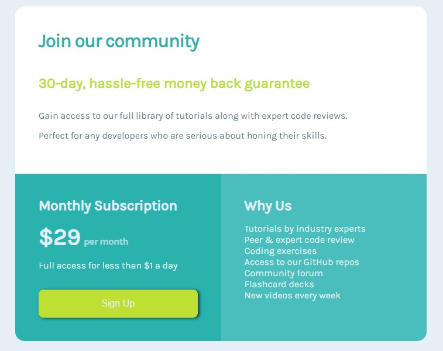

# Frontend Mentor - Single price grid component solution

This is a solution to the [Single price grid component challenge on Frontend Mentor](https://www.frontendmentor.io/challenges/single-price-grid-component-5ce41129d0ff452fec5abbbc). Frontend Mentor challenges help you improve your coding skills by building realistic projects. 

## Table of contents

- [Overview](#overview)
  - [The challenge](#the-challenge)
  - [Screenshot](#screenshot)
  - [Links](#links)
- [My process](#my-process)
  - [Built with](#built-with)
  - [What I learned](#what-i-learned)
  - [Continued development](#continued-development)
  - [Useful resources](#useful-resources)
- [Author](#author)
- [Acknowledgments](#acknowledgments)
## Overview

### The challenge

Users should be able to:

- View the optimal layout for the component depending on their device's screen size
- See a hover state on desktop for the Sign Up call-to-action

### Screenshot



### Links

- Live Site URL: (https://antoniohoutx.github.io/single-price-grid-component/index.html)

## My process

### Built with

- Semantic HTML5 markup 
- CSS custom properties
- CSS Grid
- [Styled Components](https://styled-components.com/) - For styles


### What I learned

During my work on this project my knowledge of HTML/CSS grew by leaps and bounds.  When becoming a web developer practice is far more useful tool than simply studying the material from a course.   Writing these out and providing code samples of areas you want to highlight is a great way to reinforce your own knowledge.

To see how you can add code snippets, see below:

```html
<h1>Some HTML code I'm proud of</h1>
```
```css
.proud-of-this-css {
  color: papayawhip;
}
```
```js
const proudOfThisFunc = () => {
  console.log('🎉')
}
```

If you want more help with writing markdown, we'd recommend checking out [The Markdown Guide](https://www.markdownguide.org/) to learn more.


### Continued development

Although I learned a tremendous amount in creating the desktop version of this project, I still have to work on formatting issues to make sites more mobile responsive.  This is especially true of the iOS platform.  I suspect they seem to require additional markup language in order to render websites optimized for their devices more accurately.

Additionally, I still need to refine my understanding of CSS concepts such as parent and inherited elements.  I was really stuck in nailing these concepts down and can use this experience to know in the future what I need to work on in my studies.

### Useful resources

- [Example resource 1](https://www.example.com) - This helped me for XYZ reason. I really liked this pattern and will use it going forward.
- [Example resource 2](https://www.example.com) - This is an amazing article which helped me finally understand XYZ. I'd recommend it to anyone still learning this concept.

**Note: Delete this note and replace the list above with resources that helped you during the challenge. These could come in handy for anyone viewing your solution or for yourself when you look back on this project in the future.**

## Author

- LinkedIn - [Clint Maxwell](https://www.linkedin.com/in/maxwellclint/)
- Twitter - [@clintmaxwell](https://www.twitter.com/clintmaxwell)


## Acknowledgments

I'd like to thank the wonderful people in the Slack community for their assistance on this challenge.  I'd also like to especially thank gabrielborgesdm and drull1000 for their patience and diligence in helping a HTML/CSS newbie who is just getting their feet wet learn to become a better budding web developer.
