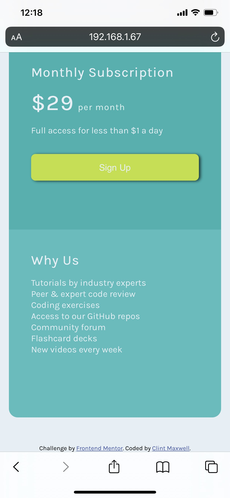

# Frontend Mentor - Single price grid component solution

This is a solution to the [Single price grid component challenge on Frontend Mentor](https://www.frontendmentor.io/challenges/single-price-grid-component-5ce41129d0ff452fec5abbbc). Frontend Mentor challenges help you improve your coding skills by building realistic projects. 

## Table of contents

- [Overview](#overview)
  - [The challenge](#the-challenge)
  - [Screenshot](#screenshot)
  - [Links](#links)
- [My process](#my-process)
  - [Built with](#built-with)
  - [What I learned](#what-i-learned)
  - [Continued development](#continued-development)
  - [Useful resources](#useful-resources)
- [Author](#author)
- [Acknowledgments](#acknowledgments)
## Overview

### The challenge

Users should be able to:

- View the optimal layout for the component depending on their device's screen size
- See a hover state on desktop for the Sign Up call-to-action

### Screenshots

#### Desktop Version

#### Mobile Version (top and bottom)



=======


### Links

- Live Site URL: (https://antoniohoutx.github.io/single-price-grid-component/index.html)

## My process

### Built with

- Semantic HTML5 markup 
- CSS custom properties
- CSS Grid
### What I learned

During my work on this project my knowledge of HTML/CSS grew by leaps and bounds.  When becoming a web developer practice is far more useful tool than simply studying the material from a course.  
I learned to create separate stylesheets (depending on the viewport width) and to reference them in the HTML.
I also learned how to use CSS Grid to arrange the various elements on this web site.

### Examples:

index.html
```html
<link rel="stylesheet" media="screen and (max-width:1440px)" href="./css/desktop.css">
<link rel="stylesheet" media="screen and (min-width:375px) and (max-width:450px)" href="./css/mobile.css">
```
### desktop.css
```css
.grid {
  margin: 4rem 20rem 4rem 20rem;
  display: grid;
  border-radius: 1rem 1rem 1rem 1rem;
  grid-template-columns: 1fr 1fr;
  grid-template-rows: 1fr 1fr;
}
```
### mobile.css
```css
.grid {
  margin: 3rem 1rem 3rem 1rem;
  display: grid;
  border-radius: 1rem 1rem 1rem 1rem;
  grid-template-columns: 1fr;
  grid-template-rows: 1fr 1fr 1fr;
}
```

### Continued development

Although I learned a tremendous amount in creating the desktop version of this project, I still have to work on formatting issues to make sites more mobile responsive.  This is especially true of the iOS platform.  I  noticed that although the challenge prompt indicated a 375px width for mobile devices, my iPhone XS Max was over 400px wide, so I adjusted the max-width property in the HTML accordingly. 

Additionally, I still need to refine my understanding of CSS concepts such as parent and inherited elements.  I was really stuck in nailing these concepts down and can use this experience to know in the future what I need to work on in my studies.

### Useful resources

- [W3 HTML Reference](https://www.w3schools.com/tags/default.asp)
- [W3 CSS Reference](https://www.w3schools.com/cssref/default.asp)

## Author

- LinkedIn - [Clint Maxwell](https://www.linkedin.com/in/maxwellclint/)
- Twitter - [@clintmaxwell](https://www.twitter.com/clintmaxwell)


## Acknowledgments

I'd like to thank the wonderful people in the Slack community for their assistance on this challenge.  I'd also like to especially thank [Gabriel Borges de Moraes](https://github.com/gabrielborgesdm) and [Drull](https://github.com/drull1000) for their patience and diligence in helping a HTML/CSS newbie who is just getting their feet wet learn to become a better budding web developer.
